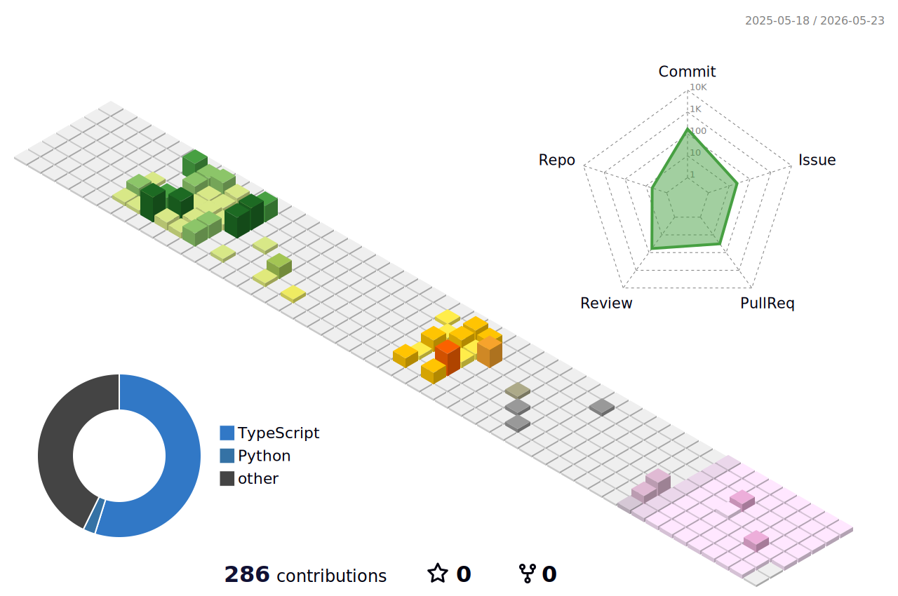

### 🙋‍♂️ About Me

안녕하세요! **React**와 **Next.js**로 프론트엔드 개발을 공부하고 있습니다.  
코드를 통해 새로운 가능성을 탐험하고, 문제를 해결하는 것을 좋아합니다.

---

### 💪 Skills

**Frontend**

**Deploy & Etc**

### 🧰 Tools

---

### 📊 GitHub Stats

